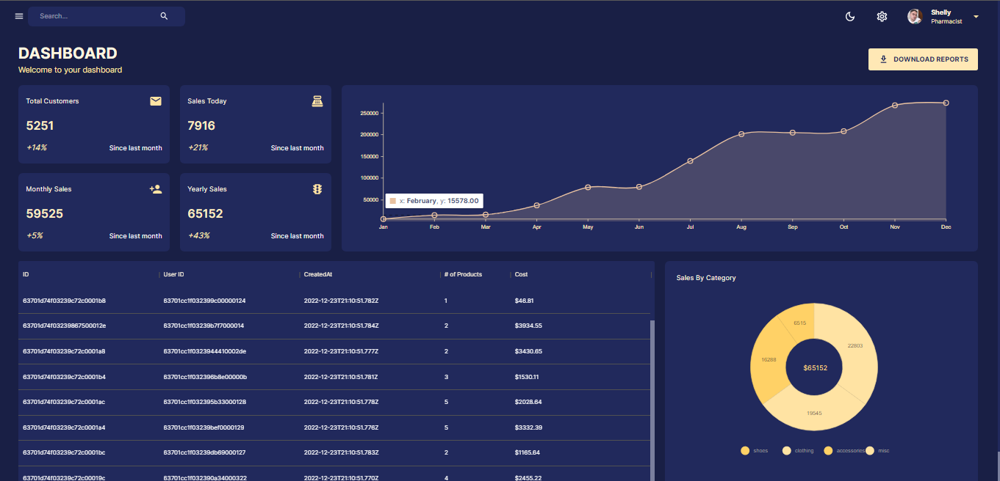

<h1 align="center">📊Dashboard app</h1>

<a href="https://dashboard-frontend1.onrender.com/" target="_blank">clique para visitar o projeto</a>

<h1>💼 Tecnologias utilizadas</h1>

Para o desenvolvimento deste site utilizei as seguintes tecnologias:

<h1>🔵Frontend</h1>
<ul>
<li>React</li>
<li>React Redux</li>
<li>Mui material</li>
<li>Nivo</li>
</ul>
 

<h1>🔴Backend</h1>
<ul>
<li>Mongodb</li>